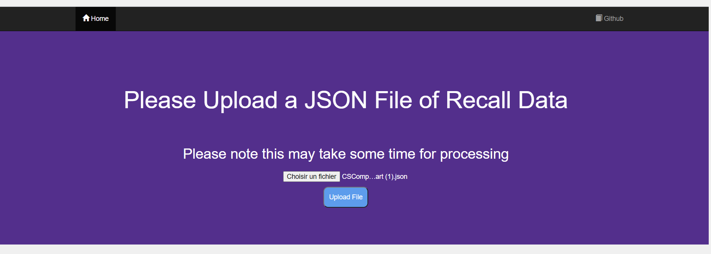
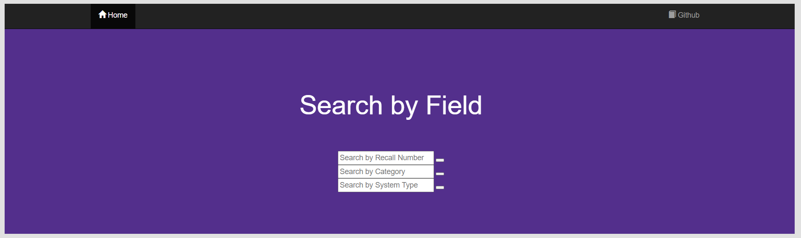

# # API_TransportCanadaVRD_NodeJs
> This project is a node.js app and express API. The app accepts json data of recall numbers and the API accepts this data, consumes transport canada's API, and posts processed data. 
> I made this as part of a government interview, if this project seems directionless. The interview was a group interview, where each participant made their own API and one person made a web app. This repository holds my API and my web app. 
Because this was made for an interview, with limited time to build, the project is not fully fleshed out. 
Steps detailed in this readme will help to run the project, because it is not very intuitive. Maybe someone will find this useful!

## Setup 
1. [Download](https://github.com/liannedls/API_TransportCanadaVRD_NodeJs/blob/master/sampleJSONdata.json) locally sample JSON data.
2. git clone git@github.com:liannedls/API_TransportCanadaVRD_NodeJs.git
3. open a terminal -> cd API_TransportCanadaVRD_NodeJ/API-3 && npm install && node index.js
4. open another terminal -> cd API_TransportCanadaVRD_NodeJ/NodeJS_WebApp && npm install && node main.js

# Test
1. Navigate to http://localhost:5000/

2. Load the JSON data downloaded in step 1.
3. Click upload file.
4. Wait for data to be processed (will take some time). You can look on your terminals to see the data being processed.
5. After processing, page http://localhost:5000/results will load. Test the search by recall number field with value "2017464".

<!-- Markdown link & img dfn's -->
[npm-image]: https://img.shields.io/npm/v/datadog-metrics.svg?style=flat-square
[npm-url]: https://npmjs.org/package/datadog-metrics
[npm-downloads]: https://img.shields.io/npm/dm/datadog-metrics.svg?style=flat-square
[travis-image]: https://img.shields.io/travis/dbader/node-datadog-metrics/master.svg?style=flat-square
[travis-url]: https://travis-ci.org/dbader/node-datadog-metrics
[wiki]: https://github.com/yourname/yourproject/wiki
